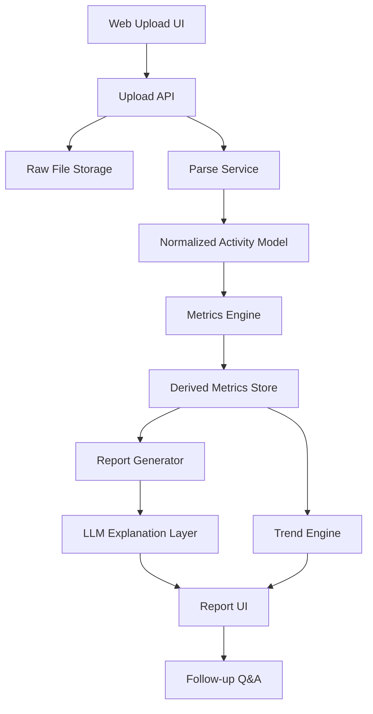

# Running AI Coach Technical Spec

> Status: this file captures the original target architecture and build plan.
> For the current implementation, use [docs/ARCHITECTURE.md](docs/ARCHITECTURE.md)
> as the source of truth and [README.md](README.md) for runtime and entrypoint
> guidance.
> The repo now implements a COROS-connected, chat-first MVP with lightweight
> local persistence, so some sections below intentionally describe a broader
> future-state design.

## 1. Objective

Design a production-oriented MVP that converts running workout data into structured metrics, readable reports, and explainable AI-driven guidance.

The system should be reliable enough to support repeated analysis, not just one-off demo output.

## 2. Architecture Principles

1. Deterministic calculations produce the facts.
2. LLM output is grounded only on structured analysis results.
3. Raw files are preserved for reprocessing.
4. Every surfaced recommendation should be traceable to supporting metrics.
5. The first version optimizes for correctness, not breadth.

## 3. Suggested Stack

Note: several items below are future-state recommendations, not hard
requirements for the current repository.

### Frontend

- Next.js
- TypeScript
- Tailwind CSS or a light component layer

### Backend API

- Python FastAPI

### Analysis Engine

- Python
- pandas / polars for time series operations
- fitparse or fitdecode for FIT ingestion
- pydantic for schemas

### Storage

- PostgreSQL for metadata and derived metrics
- Object storage or local disk for raw uploaded files

### AI Layer

- LLM provider of choice
- Prompt input should be structured JSON plus user question

## 4. High-Level System Design

Original target architecture:



## 5. Logical Components

### 5.1 Upload Service

Responsibilities:

- accept file upload,
- verify format,
- assign activity id,
- store original file,
- enqueue parsing/analysis.

### 5.2 FIT Parse Service

Responsibilities:

- extract device metadata,
- extract activity/session/lap/record messages,
- normalize units,
- discard clearly invalid records,
- produce unified time-series output.

### 5.3 Metrics Engine

Responsibilities:

- compute derived metrics,
- classify workout shape,
- detect anomalies,
- produce evidence objects for report generation.

### 5.4 Report Generator

Responsibilities:

- convert derived metrics into report JSON,
- rank insights by user value,
- attach evidence and explanation targets.

### 5.5 LLM Explanation Layer

Responsibilities:

- generate readable summary,
- answer user questions,
- explain surfaced concepts using grounded metrics only.

## 6. Data Flow

Original upload-first flow:

1. User uploads FIT file.
2. Backend stores raw file and creates activity row.
3. Parse service converts file into normalized samples.
4. Metrics engine computes derived metrics.
5. Trend engine updates user baselines using historical runs.
6. Report generator creates structured report JSON.
7. LLM generates natural-language summary and chat responses.

## 7. Normalized Domain Model

The system should normalize all activity data into a common schema so future TCX/GPX/vendor API inputs can reuse the same analysis engine.

### 7.1 Activity

```json
{
  "activity_id": "uuid",
  "user_id": "uuid",
  "sport": "running",
  "source_type": "fit_upload",
  "device_manufacturer": "garmin",
  "device_model": "Forerunner 265",
  "start_time": "2026-06-10T06:30:00Z",
  "duration_sec": 3600,
  "distance_m": 10000,
  "elevation_gain_m": 80
}
```

### 7.2 Activity Sample

```json
{
  "activity_id": "uuid",
  "timestamp": "2026-06-10T06:35:00Z",
  "elapsed_sec": 300,
  "distance_m": 1030.4,
  "speed_mps": 3.45,
  "heart_rate": 148,
  "cadence_spm": 170,
  "altitude_m": 32.1,
  "power_w": 255,
  "vertical_oscillation_mm": 81,
  "ground_contact_time_ms": 247,
  "latitude": 31.223,
  "longitude": 121.445
}
```

### 7.3 Derived Metrics

```json
{
  "activity_id": "uuid",
  "avg_pace_sec_per_km": 360,
  "pace_stability_score": 0.82,
  "pace_fade_pct": 4.8,
  "avg_hr": 151,
  "max_hr": 168,
  "hr_drift_pct": 6.5,
  "hr_recovery_1min": 28,
  "hr_recovery_2min": 40,
  "cadence_avg": 171,
  "cadence_stability_score": 0.79,
  "stride_length_m": 1.01,
  "aerobic_efficiency_score": 0.67,
  "training_load_score": 54,
  "fatigue_risk_level": "medium",
  "run_type_guess": "easy_run"
}
```

## 8. Database Tables

These tables describe a recommended durable data model, not the current MVP
storage layout. The repo currently uses lightweight local JSON and JSONL files
for OAuth sessions, uploads, and same-type workout history.

Recommended initial tables:

### users

- id
- email
- display_name
- created_at

### activities

- id
- user_id
- sport
- source_type
- source_filename
- raw_file_path
- device_manufacturer
- device_model
- start_time
- duration_sec
- distance_m
- elevation_gain_m
- status
- created_at

### activity_samples

- id
- activity_id
- timestamp
- elapsed_sec
- distance_m
- speed_mps
- heart_rate
- cadence_spm
- altitude_m
- power_w
- vertical_oscillation_mm
- ground_contact_time_ms
- latitude
- longitude

### derived_metrics

- activity_id
- avg_pace_sec_per_km
- pace_stability_score
- pace_fade_pct
- avg_hr
- max_hr
- hr_drift_pct
- hr_recovery_1min
- hr_recovery_2min
- cadence_avg
- cadence_stability_score
- stride_length_m
- aerobic_efficiency_score
- training_load_score
- fatigue_risk_level
- run_type_guess
- created_at

### analysis_reports

- id
- activity_id
- version
- report_json
- llm_summary
- created_at

### chat_sessions

- id
- user_id
- activity_id
- created_at

### chat_messages

- id
- session_id
- role
- content
- grounded_context_json
- created_at

## 9. Core Metric Definitions

### 9.1 Pace Stability

Purpose:

- determine how evenly the runner paced the workout.

Possible approach:

- split the run into distance-normalized segments,
- compute coefficient of variation for pace,
- adjust for pauses and large elevation changes.

### 9.2 Pace Fade

Purpose:

- determine whether the later part of the run slowed materially.

Possible approach:

- compare final third or final quarter pace against early steady-state portion,
- ignore warm-up and cool-down where detectable.

### 9.3 Heart Rate Drift / Decoupling

Purpose:

- estimate how much cardiovascular cost rises relative to external output over time.

Possible approach:

- select steady-state middle section,
- compare pace-to-heart-rate ratio or power-to-heart-rate ratio between first and second halves,
- express as percentage change.

### 9.4 Heart Rate Recovery

Purpose:

- measure post-exercise recovery response.

Possible approach:

- find end-of-exercise heart rate,
- compute drop at 60 and 120 seconds after stop,
- mark as unavailable if post-stop data is missing.

### 9.5 Cadence Stability

Purpose:

- understand whether stride rhythm is steady or chaotic.

Possible approach:

- compute cadence variability after excluding stop segments and major grade events.

### 9.6 Aerobic Efficiency Proxy

Purpose:

- compare how much pace the runner gets for a given internal effort.

Possible approach:

- within selected heart rate bands, track pace over time against historical baseline,
- optionally derive pace-per-heartbeat proxy.

### 9.7 Training Load Score

Purpose:

- provide a simple load estimate for short-term fatigue tracking.

Possible approach:

- combine duration and intensity weighting,
- keep formula simple for MVP,
- avoid pretending it is a medically validated fatigue score.

### 9.8 Fatigue Risk Flag

Purpose:

- warn when recent training pattern suggests reduced recovery margin.

Possible approach:

- combine rolling 7-day load, rolling 28-day load, recent heart rate recovery trend, and pace efficiency degradation.

## 10. Baseline and Trend Engine

The product becomes more valuable once it compares current runs to the user's own history instead of population averages.

### Inputs

- last 7 days of runs,
- last 28 days of runs,
- prior runs of similar duration or intent,
- optional user profile fields such as age, goals, max HR estimate.

### Outputs

- load delta,
- efficiency delta,
- fatigue trend,
- recovery trend,
- workout consistency trend.

### Rule

Prefer self-comparison over absolute grading.

## 11. Report JSON Contract

Create report JSON first, then render it in UI and use it as LLM context.

```json
{
  "summary": "string",
  "run_type_guess": "easy_run",
  "key_findings": [
    {
      "title": "Heart rate drift increased",
      "detail": "Heart rate rose 6.5% in the second half while pace remained similar.",
      "why_it_matters": "This can indicate limited aerobic durability or poor environmental management.",
      "evidence": {
        "hr_drift_pct": 6.5,
        "pace_fade_pct": 1.2
      }
    }
  ],
  "risks": [
    {
      "title": "Recovery may be limited",
      "detail": "Recent 7-day load is elevated and HR recovery is below your 4-week median."
    }
  ],
  "next_run_recommendation": {
    "type": "easy_run",
    "detail": "Run 40 minutes easy and keep effort controlled on any incline.",
    "reason": "Current load and drift signal suggest recovery and aerobic control should be prioritized."
  },
  "metrics": {
    "pace_stability_score": 0.82,
    "pace_fade_pct": 4.8,
    "hr_drift_pct": 6.5,
    "hr_recovery_1min": 28,
    "cadence_stability_score": 0.79,
    "aerobic_efficiency_score": 0.67,
    "fatigue_risk_level": "medium"
  }
}
```

## 12. LLM Boundary Design

### LLM Should Do

- summarize findings clearly,
- answer user questions about concepts,
- explain why a recommendation was made,
- adapt language to beginner vs advanced runner.

### LLM Must Not Do

- invent unsupported metrics,
- override deterministic calculations,
- make medical diagnoses,
- claim certainty when signal confidence is low.

### Input to LLM

- report JSON,
- historical trend summary,
- user question,
- response style constraints.

### Output Constraints

- mention only grounded values,
- keep recommendation count small,
- include caveat if data quality is weak.

## 13. Prompt Strategy

### System Prompt Intent

You are a running analysis assistant. Explain structured workout findings in plain language. Use only metrics supplied in the input. Do not invent facts. Do not give medical diagnosis. Prefer one main recommendation over many weak suggestions.

### Report Prompt Input Example

```json
{
  "user_level": "beginner",
  "report": {"...": "..."},
  "trend_summary": {"...": "..."}
}
```

### Follow-Up Prompt Input Example

```json
{
  "question": "Why is heart rate drift important?",
  "report": {"...": "..."},
  "history": {"...": "..."}
}
```

## 14. API Endpoints

### POST /api/uploads

Purpose:

- upload FIT file and create activity.

Response:

- activity id,
- processing status.

### GET /api/activities/:id

Purpose:

- return activity metadata and derived metrics.

### GET /api/activities/:id/report

Purpose:

- return structured report JSON and rendered summary.

### GET /api/users/:id/trends

Purpose:

- return recent trend summary.

### POST /api/chat

Purpose:

- answer follow-up question for a report using grounded context.

## 15. File and Service Layout

This section is intentionally aspirational. The actual current layout is the
root-level `api/` + `web/` split documented in [docs/ARCHITECTURE.md](docs/ARCHITECTURE.md).

Suggested monorepo shape:

```text
running-ai-coach/
  apps/
    web/
    api/
  packages/
    domain/
    analysis-engine/
    prompt-contracts/
    ui/
  docs/
```

If you want lower setup cost, a simpler split also works:

```text
running-ai-coach/
  frontend/
  backend/
  analysis/
  docs/
```

## 16. Build Sequence

Historical implementation plan:

### Week 1

- create upload UI,
- store FIT files,
- parse raw FIT into normalized activity and sample data,
- display raw run summary.

### Week 2

- implement first five derived metrics,
- create report JSON contract,
- build report page without chat.

### Week 3

- add LLM summary generation,
- add follow-up Q&A with grounded report context,
- add recent trend calculations.

### Week 4

- test with 10 to 20 runners,
- improve metric definitions,
- tune prompts and evidence ranking,
- add retention instrumentation.

## 17. Validation Plan

Test with real user data, not synthetic examples only.

### Required Checks

1. FIT files from at least 3 device types.
2. Runs with and without advanced running dynamics.
3. Short run, long run, interval-like run, and easy run patterns.
4. Missing post-run HR recovery data.
5. GPS noise or pause-heavy workouts.

### Output Review Criteria

1. Are computed metrics numerically sensible?
2. Does the report stay faithful to those metrics?
3. Does the main recommendation feel specific?
4. Are explanations readable for beginners?

## 18. Observability and Quality

Track these internal events:

- upload success/failure,
- parse success/failure,
- metric computation success/failure,
- report generation latency,
- chat question rate,
- repeat uploads per user.

Keep analysis versioned so old reports can be regenerated when formulas change.

## 19. Risk Register

### Risk: unreliable metrics from low-quality files

Mitigation:

- add confidence flags,
- suppress low-confidence claims.

### Risk: LLM sounds authoritative but wrong

Mitigation:

- force grounded inputs only,
- include evidence per finding,
- block unsupported claims.

### Risk: users want device sync immediately

Mitigation:

- explain that file upload is the fastest way to start,
- validate recurring use before integration work.

### Risk: product feels generic

Mitigation:

- prioritize user-history comparison,
- prefer one sharp recommendation over many vague observations.

## 20. Immediate Build Tasks

Historical note: these tasks were largely the original implementation queue and
should not be treated as the current repo backlog.

1. Pick backend language and FIT parsing library.
2. Define normalized activity and sample schema in code.
3. Implement upload to storage plus activity creation.
4. Implement first metrics: pace stability, pace fade, HR drift, HR recovery, cadence stability.
5. Emit report JSON before any free-form summary generation.
6. Add a minimal report UI.
