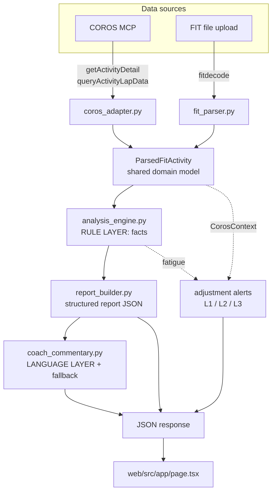

# Architecture

This is the **current** source of truth for how the system works today.
For *why* each decision was made, see [adr/](adr/). For the eventual target
design, see [../TECHNICAL-SPEC.md](../TECHNICAL-SPEC.md).

## One-paragraph summary

Two data sources (COROS MCP, FIT upload) both map into one shared domain model,
which flows through a deterministic rule layer (facts) and then an LLM language
layer (words), producing one report JSON consumed by a single-page frontend.
The system is currently stateless — see [adr/0005](adr/0005-statelessness-and-persistence-gap.md)
and the persistence design in [PERSISTENCE-DESIGN.md](PERSISTENCE-DESIGN.md).

## Component diagram

## Endpoints

| Method | Path | Purpose | Source |
|--------|------|---------|--------|
| GET  | `/healthz` | health check | — |
| POST | `/api/v1/activities/analyze` | analyze a COROS activity by `labelId` + `sportType` | COROS MCP |
| POST | `/api/v1/activities/upload`  | analyze an uploaded FIT file | FIT |

Both analysis endpoints return the same report shape (summary, metrics,
analysis, report, coach_commentary). `/analyze` additionally returns
`coros_context` and `adjustment_alerts`.

## The shared domain model

`ParsedFitActivity` (in `services/fit_parser.py`) is the contract. Key nested
types:

- `ParsedFitMetrics` — avg pace, pace stability/fade, HR, HR drift, cadence,
  step length, stance time, interval/recovery counts.
- `ParsedFitLap` — per-lap distance/time/pace/HR.
- `ParsedFitSegment` — classified segments (`warmup` / `interval` / `recovery` /
  `cooldown` / `steady_run`), the basis for separating work vs rest.

`CorosContext` (in `services/coros_adapter.py`) is the **side channel** for
signals that don't belong in a FIT-shaped model: recovery %, sleep HRV, resting
HR, training load ATL/CTL, and the L1 trigger deltas (`hrv_drop_pct`,
`rhr_spike_bpm`).

## The two layers

**Rule layer** (`analysis_engine.py`, `report_builder.py`) — deterministic.
Produces training type, EF ratio, recovery quality, fatigue risk, mechanics
score, intensity level, findings, risks, and the next-run recommendation.

**Language layer** (`coach_commentary.py`) — the LLM rephrases the rule-layer
facts into `summary` / `strengths` / `watchouts` / `next_steps`. A deterministic
fallback covers the no-LLM case. See [adr/0001](adr/0001-rule-layer-first.md).

## Configuration

`api/.env.local` (copy from `.env.example`):

- `LLM_API_KEY`, `LLM_MODEL`, `LLM_BASE_URL` — OpenAI-compatible LLM.
- `COROS_ACCESS_TOKEN` — only for standalone server use; MCP hosts handle auth.
